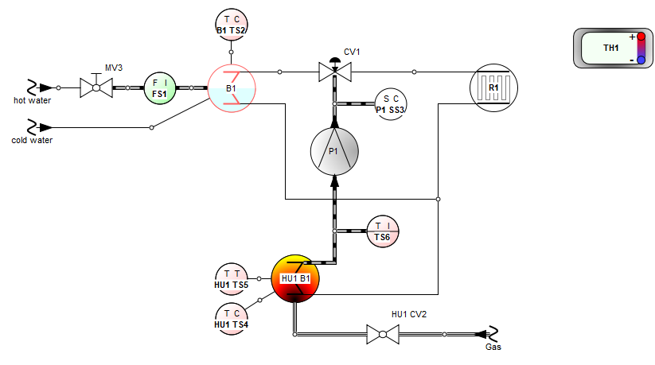
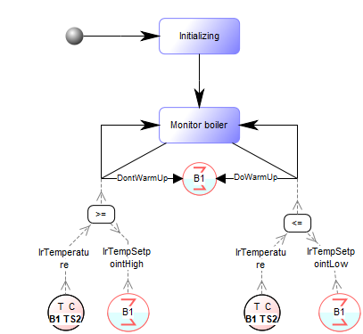
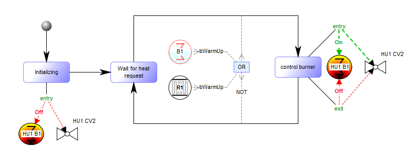
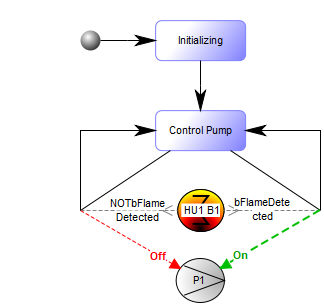
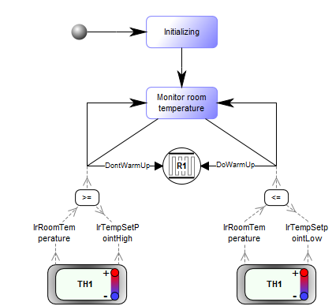
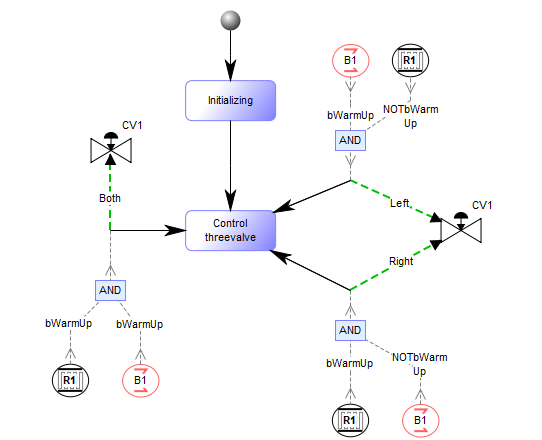

# HomeHeating Documentation report

**Filename:** HomeHeating.md **Date:** pe 13.03.2026

**Table of contents:**
- [HomeHeating: P&I Diagram](#15_377)
- [BoilerController: Heating application](#15_386)
- [HeatController: Heating application](#15_380)
- [PumpController: Heating application](#15_374)
- [RadiatorController: Heating application](#15_383)
- [ThreeValveController: Heating application](#15_371)

## HomeHeating: P&I Diagram
Graph properties:
| Property | Value |
|:---|:---|
|System name|HomeHeating|
|Description|Sample heating system|
|Use visualization|T|

**Diagram picture:** HomeHeating

**Graph dictionary**
| Object | Type | Documentation |
|:---|:---|:---|
| [B1](#15_569) | Boiler |  |
| [HU1 B1](#15_1114) | Burner |  |
| [P1](#15_1256) | Pump |  |
| [R1](#15_1305) | Radiator |  |
| [B1 TS2](#15_544) | Sensor |  |
| [FS1](#15_1410) | Sensor |  |
| [HU1 TS4](#15_1135) | Sensor |  |
| [HU1 TS5](#15_1491) | Sensor |  |
| [P1 SS3](#15_870) | Sensor |  |
| [TS6](#15_1324) | Sensor |  |
| [cold water](#15_550) | System end |  |
| [Gas](#15_655) | System end |  |
| [hot water](#15_1235) | System end |  |
| [TH1](#15_1139) | Thermostat | Thermostate controlling room temperature |
| [CV1](#15_946) | Valve |  |
| [HU1 CV2](#15_400) | Valve |  |
| [MV3](#15_784) | Valve |  |

### B1: Boiler
Properties:
| Property | Value |
|:---|:---|
|Name|B1|

**B1** relationships:
| In role | In relationship | With objects(s) | In role |
|:---|:---|:---|:---|
|: Pipe|10: Pipe&#xA;|[FS1](#15_1410)|: Pipe|
|: Pipe|10: Pipe&#xA;|[B1 TS2](#15_544)|: Pipe|
|: Pipe|10: Pipe&#xA;|[CV1](#15_946)|: Pipe|
|: Pipe|10: Pipe&#xA;|[cold water](#15_550)|: Pipe|
|: Pipe|10: Pipe&#xA;|[R1](#15_1305)|: Pipe|
| | |[HU1 B1](#15_1114)|: Pipe|

**B1** subgraph links
| Link type	| Graph's name |
|:---|:---|
| Decomposition | none|
| Explosions | [BoilerController](#15_386)|

### HU1 B1: Burner
Properties:
| Property | Value |
|:---|:---|
|Name|HU1 B1|

**HU1 B1** relationships:
| In role | In relationship | With objects(s) | In role |
|:---|:---|:---|:---|
|: Pipe|10: Pipe&#xA;|[HU1 TS4](#15_1135)|: Pipe|
|: Pipe|10: Pipe&#xA;|[TS6](#15_1324)|: Pipe|
| | |[P1](#15_1256)|: PipeIn|
|: Pipe|10: Pipe&#xA;|[R1](#15_1305)|: Pipe|
| | |[B1](#15_569)|: Pipe|
|: Pipe|10: Pipe&#xA;|[HU1 TS5](#15_1491)|: Pipe|
|: Pipe|10: Pipe&#xA;|[HU1 CV2](#15_400)|: Pipe|

**HU1 B1** subgraph links
| Link type	| Graph's name |
|:---|:---|
| Decomposition | none|
| Explosions | [HeatController](#15_380)|

### P1: Pump
Properties:
| Property | Value |
|:---|:---|
|Name|P1|
|Pump type|pump|

**P1** relationships:
| In role | In relationship | With objects(s) | In role |
|:---|:---|:---|:---|
|: PipeIn|10: Pipe&#xA;|[TS6](#15_1324)|: Pipe|
| | |[HU1 B1](#15_1114)|: Pipe|
|: PipeOut|10: Pipe&#xA;|[P1 SS3](#15_870)|: Pipe|
| | |[CV1](#15_946)|: Pipe|

**P1** subgraph links
| Link type	| Graph's name |
|:---|:---|
| Decomposition | none|
| Explosions | [PumpController](#15_374)|

### R1: Radiator
Properties:
| Property | Value |
|:---|:---|
|Name|R1|

**R1** relationships:
| In role | In relationship | With objects(s) | In role |
|:---|:---|:---|:---|
|: Pipe|10: Pipe&#xA;|[HU1 B1](#15_1114)|: Pipe|
| | |[B1](#15_569)|: Pipe|
|: Pipe|10: Pipe&#xA;|[CV1](#15_946)|: Pipe|

**R1** subgraph links
| Link type	| Graph's name |
|:---|:---|
| Decomposition | none|
| Explosions | [RadiatorController](#15_383)|

### B1 TS2: Sensor
Properties:
| Property | Value |
|:---|:---|
|Name|B1 TS2|
|Mounting|near the process|
|Measured variable|Temperature|
|Function|Controller|

**B1 TS2** relationships:
| In role | In relationship | With objects(s) | In role |
|:---|:---|:---|:---|
|: Pipe|10: Pipe&#xA;|[B1](#15_569)|: Pipe|

**B1 TS2** subgraph links: none

### FS1: Sensor
Properties:
| Property | Value |
|:---|:---|
|Name|FS1|
|Mounting|near the process|
|Measured variable|Flow|
|Function|Indicator|

**FS1** relationships:
| In role | In relationship | With objects(s) | In role |
|:---|:---|:---|:---|
|: Pipe|10: Pipe&#xA;|[MV3](#15_784)|: Pipe|
|: Pipe|10: Pipe&#xA;|[B1](#15_569)|: Pipe|

**FS1** subgraph links: none

### HU1 TS4: Sensor
Properties:
| Property | Value |
|:---|:---|
|Name|HU1 TS4|
|Mounting|near the process|
|Measured variable|Temperature|
|Function|Controller|

**HU1 TS4** relationships:
| In role | In relationship | With objects(s) | In role |
|:---|:---|:---|:---|
|: Pipe|10: Pipe&#xA;|[HU1 B1](#15_1114)|: Pipe|

**HU1 TS4** subgraph links: none

### HU1 TS5: Sensor
Properties:
| Property | Value |
|:---|:---|
|Name|HU1 TS5|
|Mounting|near the process|
|Measured variable|Temperature|
|Function|Transmitter|

**HU1 TS5** relationships:
| In role | In relationship | With objects(s) | In role |
|:---|:---|:---|:---|
|: Pipe|10: Pipe&#xA;|[HU1 B1](#15_1114)|: Pipe|

**HU1 TS5** subgraph links: none

### P1 SS3: Sensor
Properties:
| Property | Value |
|:---|:---|
|Name|P1 SS3|
|Mounting|near the process|
|Measured variable|Speed|
|Function|Controller|

**P1 SS3** relationships:
| In role | In relationship | With objects(s) | In role |
|:---|:---|:---|:---|
|: Pipe|10: Pipe&#xA;|[CV1](#15_946)|: Pipe|
| | |[P1](#15_1256)|: PipeOut|

**P1 SS3** subgraph links: none

### TS6: Sensor
Properties:
| Property | Value |
|:---|:---|
|Name|TS6|
|Mounting|in the control room|
|Measured variable|Temperature|
|Function|Indicator|

**TS6** relationships:
| In role | In relationship | With objects(s) | In role |
|:---|:---|:---|:---|
|: Pipe|10: Pipe&#xA;|[HU1 B1](#15_1114)|: Pipe|
| | |[P1](#15_1256)|: PipeIn|

**TS6** subgraph links: none

### cold water: System end
Properties:
| Property | Value |
|:---|:---|
|Name|cold water|
|Direction|Source|

**cold water** relationships:
| In role | In relationship | With objects(s) | In role |
|:---|:---|:---|:---|
|: Pipe|10: Pipe&#xA;|[B1](#15_569)|: Pipe|

**cold water** subgraph links: none

### Gas: System end
Properties:
| Property | Value |
|:---|:---|
|Name|Gas|
|Direction|Source|

**Gas** relationships:
| In role | In relationship | With objects(s) | In role |
|:---|:---|:---|:---|
|: Pipe|10: Pipe&#xA;|[HU1 CV2](#15_400)|: Pipe|

**Gas** subgraph links: none

### hot water: System end
Properties:
| Property | Value |
|:---|:---|
|Name|hot water|
|Direction|Source|

**hot water** relationships:
| In role | In relationship | With objects(s) | In role |
|:---|:---|:---|:---|
|: Pipe|10: Pipe&#xA;|[MV3](#15_784)|: Pipe|

**hot water** subgraph links: none

### TH1: Thermostat
Properties:
| Property | Value |
|:---|:---|
|Name|TH1|
|Description|Thermostate controlling room temperature|

**TH1** relationships:
none

**TH1** subgraph links: none

### CV1: Valve
Properties:
| Property | Value |
|:---|:---|
|Name|CV1|
|Number of valve ends|Three|
|Valve type|Control|
|Closing by|needle|

**CV1** relationships:
| In role | In relationship | With objects(s) | In role |
|:---|:---|:---|:---|
|: Pipe|10: Pipe&#xA;|[R1](#15_1305)|: Pipe|
|: Pipe|10: Pipe&#xA;|[P1 SS3](#15_870)|: Pipe|
| | |[P1](#15_1256)|: PipeOut|
|: Pipe|10: Pipe&#xA;|[B1](#15_569)|: Pipe|

**CV1** subgraph links
| Link type	| Graph's name |
|:---|:---|
| Decomposition | none|
| Explosions | [ThreeValveController](#15_371)|

### HU1 CV2: Valve
Properties:
| Property | Value |
|:---|:---|
|Name|HU1 CV2|
|Number of valve ends|Two|
|Valve type|Normal|
|Closing by|ball|

**HU1 CV2** relationships:
| In role | In relationship | With objects(s) | In role |
|:---|:---|:---|:---|
|: Pipe|10: Pipe&#xA;|[HU1 B1](#15_1114)|: Pipe|
|: Pipe|10: Pipe&#xA;|[Gas](#15_655)|: Pipe|

**HU1 CV2** subgraph links: none

### MV3: Valve
Properties:
| Property | Value |
|:---|:---|
|Name|MV3|
|Number of valve ends|Two|
|Valve type|Manual|
|Closing by|ball|

**MV3** relationships:
| In role | In relationship | With objects(s) | In role |
|:---|:---|:---|:---|
|: Pipe|10: Pipe&#xA;|[hot water](#15_1235)|: Pipe|
|: Pipe|10: Pipe&#xA;|[FS1](#15_1410)|: Pipe|

**MV3** subgraph links: none

**Sub-objects:**

none

## BoilerController: Heating application
Graph properties:
| Property | Value |
|:---|:---|
|System name|BoilerController|
|Description|Boiler warming based on requested temperature from TS2|
|Use visualization|T|

**Diagram picture:** BoilerController

**Graph dictionary**
| Object | Type | Documentation |
|:---|:---|:---|
| [B1](#15_569) | Boiler |  |
| [\<=](#15_1090) | Comparison |  |
| [\>=](#15_436) | Comparison |  |
| [B1 TS2](#15_544) | Sensor |  |
| [Start](#15_876) | Start |  |
| [Initializing](#15_1288) | State |  |
| [Monitor boiler](#15_603) | State |  |

### B1: Boiler
Properties:
| Property | Value |
|:---|:---|
|Name|B1|

**B1** relationships:
| In role | In relationship | With objects(s) | In role |
|:---|:---|:---|:---|
|lrTempSetpointHigh: Boiler condition|: Condition|[\>=](#15_436)|: Right|
|lrTempSetpointLow: Boiler condition|: Condition|[\<=](#15_1090)|: Right|
|DontWarmUp: Heat exchanger action|: Transition|[\>=](#15_436)|F: Condition|
| | |[Monitor boiler](#15_603)|: From|
| | |[Monitor boiler](#15_603)|: To|
|DoWarmUp: Heat exchanger action|: Transition|[\<=](#15_1090)|F: Condition|
| | |[Monitor boiler](#15_603)|: From|
| | |[Monitor boiler](#15_603)|: To|

**B1** subgraph links: none

### \<=: Comparison
Properties:
| Property | Value |
|:---|:---|
|Comparison|\<=|

**<=** relationships:
| In role | In relationship | With objects(s) | In role |
|:---|:---|:---|:---|
|F: Condition|: Transition|[Monitor boiler](#15_603)|: From|
| | |[B1](#15_569)|DoWarmUp: Heat exchanger action|
| | |[Monitor boiler](#15_603)|: To|
|: Left|: Condition|[B1 TS2](#15_544)|lrTemperature: Sensor condition|
|: Right|: Condition|[B1](#15_569)|lrTempSetpointLow: Boiler condition|

**\<=** subgraph links: none

### \>=: Comparison
Properties:
| Property | Value |
|:---|:---|
|Comparison|\>=|

**>=** relationships:
| In role | In relationship | With objects(s) | In role |
|:---|:---|:---|:---|
|F: Condition|: Transition|[Monitor boiler](#15_603)|: From|
| | |[B1](#15_569)|DontWarmUp: Heat exchanger action|
| | |[Monitor boiler](#15_603)|: To|
|: Left|: Condition|[B1 TS2](#15_544)|lrTemperature: Sensor condition|
|: Right|: Condition|[B1](#15_569)|lrTempSetpointHigh: Boiler condition|

**\>=** subgraph links: none

### B1 TS2: Sensor
Properties:
| Property | Value |
|:---|:---|
|Name|B1 TS2|
|Mounting|near the process|
|Measured variable|Temperature|
|Function|Controller|

**B1 TS2** relationships:
| In role | In relationship | With objects(s) | In role |
|:---|:---|:---|:---|
|lrTemperature: Sensor condition|: Condition|[\>=](#15_436)|: Left|
|lrTemperature: Sensor condition|: Condition|[\<=](#15_1090)|: Left|

**B1 TS2** subgraph links: none

### Start: Start
Properties:
none

**Start** relationships:
| In role | In relationship | With objects(s) | In role |
|:---|:---|:---|:---|
|: From|: Transition|[Initializing](#15_1288)|: To|

**Start** subgraph links: none

### Initializing: State
Properties:
| Property | Value |
|:---|:---|
|State name|Initializing|
|Description||

**Initializing** relationships:
| In role | In relationship | With objects(s) | In role |
|:---|:---|:---|:---|
|: From|: Transition|[Monitor boiler](#15_603)|: To|
|: To|: Transition|[Start](#15_876)|: From|

**Initializing** subgraph links: none

### Monitor boiler: State
Properties:
| Property | Value |
|:---|:---|
|State name|Monitor boiler|
|Description||

**Monitor boiler** relationships:
| In role | In relationship | With objects(s) | In role |
|:---|:---|:---|:---|
|: From|: Transition|[\>=](#15_436)|F: Condition|
| | |[B1](#15_569)|DontWarmUp: Heat exchanger action|
| | |[Monitor boiler](#15_603)|: To|
|: From|: Transition|[\<=](#15_1090)|F: Condition|
| | |[B1](#15_569)|DoWarmUp: Heat exchanger action|
| | |[Monitor boiler](#15_603)|: To|
|: To|: Transition|[\>=](#15_436)|F: Condition|
| | |[Monitor boiler](#15_603)|: From|
| | |[B1](#15_569)|DontWarmUp: Heat exchanger action|
|: To|: Transition|[Initializing](#15_1288)|: From|
|: To|: Transition|[\<=](#15_1090)|F: Condition|
| | |[Monitor boiler](#15_603)|: From|
| | |[B1](#15_569)|DoWarmUp: Heat exchanger action|

**Monitor boiler** subgraph links: none

**Sub-objects:**

none

## HeatController: Heating application
Graph properties:
| Property | Value |
|:---|:---|
|System name|HeatController|
|Description||
|Use visualization|T|

**Diagram picture:** HeatController

**Graph dictionary**
| Object | Type | Documentation |
|:---|:---|:---|
| [B1](#15_569) | Boiler |  |
| [HU1 B1](#15_1114) | Burner |  |
| [OR](#15_450) | Condition |  |
| [R1](#15_1305) | Radiator |  |
| [Start](#15_929) | Start |  |
| [control burner](#15_677) | State |  |
| [Initializing](#15_847) | State |  |
| [Wait for heat request](#15_1015) | State |  |
| [HU1 CV2](#15_400) | Valve |  |

### B1: Boiler
Properties:
| Property | Value |
|:---|:---|
|Name|B1|

**B1** relationships:
| In role | In relationship | With objects(s) | In role |
|:---|:---|:---|:---|
|bWarmUp: Boiler condition|: Condition|[OR](#15_450)|: Cond|

**B1** subgraph links: none

### HU1 B1: Burner
Properties:
| Property | Value |
|:---|:---|
|Name|HU1 B1|

**HU1 B1** relationships:
| In role | In relationship | With objects(s) | In role |
|:---|:---|:---|:---|
|Off: Action|: Entry action|[Initializing](#15_847)|: State entry exit|
| | |[HU1 CV2](#15_400)|Close: Valve action|
|Off: Action|: Exit action|[control burner](#15_677)|: State entry exit|
| | |[HU1 CV2](#15_400)|Close: Valve action|
|On: Action|: Entry action|[control burner](#15_677)|: State entry exit|
| | |[HU1 CV2](#15_400)|Open: Valve action|

**HU1 B1** subgraph links: none

### OR: Condition
Properties:
| Property | Value |
|:---|:---|
|Condition|OR|

**OR** relationships:
| In role | In relationship | With objects(s) | In role |
|:---|:---|:---|:---|
|: Cond|: Condition|[B1](#15_569)|bWarmUp: Boiler condition|
|: Cond|: Condition|[R1](#15_1305)|bWarmUp: Radiator condition|
|F: Condition|: Transition|[Wait for heat request](#15_1015)|: From|
| | |[control burner](#15_677)|: To|
|T: Condition|: Transition|[control burner](#15_677)|: From|
| | |[Wait for heat request](#15_1015)|: To|

**OR** subgraph links: none

### R1: Radiator
Properties:
| Property | Value |
|:---|:---|
|Name|R1|

**R1** relationships:
| In role | In relationship | With objects(s) | In role |
|:---|:---|:---|:---|
|bWarmUp: Radiator condition|: Condition|[OR](#15_450)|: Cond|

**R1** subgraph links: none

### Start: Start
Properties:
none

**Start** relationships:
| In role | In relationship | With objects(s) | In role |
|:---|:---|:---|:---|
|: From|: Transition|[Initializing](#15_847)|: To|

**Start** subgraph links: none

### control burner: State
Properties:
| Property | Value |
|:---|:---|
|State name|control burner|
|Description||

**control burner** relationships:
| In role | In relationship | With objects(s) | In role |
|:---|:---|:---|:---|
|: From|: Transition|[OR](#15_450)|T: Condition|
| | |[Wait for heat request](#15_1015)|: To|
|: State entry exit|: Exit action|[HU1 B1](#15_1114)|Off: Action|
| | |[HU1 CV2](#15_400)|Close: Valve action|
|: State entry exit|: Entry action|[HU1 B1](#15_1114)|On: Action|
| | |[HU1 CV2](#15_400)|Open: Valve action|
|: To|: Transition|[OR](#15_450)|F: Condition|
| | |[Wait for heat request](#15_1015)|: From|

**control burner** subgraph links: none

### Initializing: State
Properties:
| Property | Value |
|:---|:---|
|State name|Initializing|
|Description||

**Initializing** relationships:
| In role | In relationship | With objects(s) | In role |
|:---|:---|:---|:---|
|: From|: Transition|[Wait for heat request](#15_1015)|: To|
|: State entry exit|: Entry action|[HU1 B1](#15_1114)|Off: Action|
| | |[HU1 CV2](#15_400)|Close: Valve action|
|: To|: Transition|[Start](#15_929)|: From|

**Initializing** subgraph links: none

### Wait for heat request: State
Properties:
| Property | Value |
|:---|:---|
|State name|Wait for heat request|
|Description||

**Wait for heat request** relationships:
| In role | In relationship | With objects(s) | In role |
|:---|:---|:---|:---|
|: From|: Transition|[OR](#15_450)|F: Condition|
| | |[control burner](#15_677)|: To|
|: To|: Transition|[OR](#15_450)|T: Condition|
| | |[control burner](#15_677)|: From|
|: To|: Transition|[Initializing](#15_847)|: From|

**Wait for heat request** subgraph links: none

### HU1 CV2: Valve
Properties:
| Property | Value |
|:---|:---|
|Name|HU1 CV2|
|Number of valve ends|Two|
|Valve type|Normal|
|Closing by|ball|

**HU1 CV2** relationships:
| In role | In relationship | With objects(s) | In role |
|:---|:---|:---|:---|
|Close: Valve action|: Exit action|[HU1 B1](#15_1114)|Off: Action|
| | |[control burner](#15_677)|: State entry exit|
|Close: Valve action|: Entry action|[HU1 B1](#15_1114)|Off: Action|
| | |[Initializing](#15_847)|: State entry exit|
|Open: Valve action|: Entry action|[HU1 B1](#15_1114)|On: Action|
| | |[control burner](#15_677)|: State entry exit|

**HU1 CV2** subgraph links: none

**Sub-objects:**

none

## PumpController: Heating application
Graph properties:
| Property | Value |
|:---|:---|
|System name|PumpController|
|Description|Pump is put on or off depending on flame detection\.|
|Use visualization|T|

**Diagram picture:** PumpController

**Graph dictionary**
| Object | Type | Documentation |
|:---|:---|:---|
| [HU1 B1](#15_1114) | Burner |  |
| [P1](#15_1256) | Pump |  |
| [Start](#15_619) | Start |  |
| [Control Pump](#15_1056) | State |  |
| [Initializing](#15_810) | State |  |

### HU1 B1: Burner
Properties:
| Property | Value |
|:---|:---|
|Name|HU1 B1|

**HU1 B1** relationships:
| In role | In relationship | With objects(s) | In role |
|:---|:---|:---|:---|
|bFlameDetected: Burner condition|: Transition|[P1](#15_1256)|On: Action|
| | |[Control Pump](#15_1056)|: From|
| | |[Control Pump](#15_1056)|: To|
|bFlameDetected: Burner condition|: Transition|[P1](#15_1256)|Off: Action|
| | |[Control Pump](#15_1056)|: From|
| | |[Control Pump](#15_1056)|: To|

**HU1 B1** subgraph links: none

### P1: Pump
Properties:
| Property | Value |
|:---|:---|
|Name|P1|
|Pump type|pump|

**P1** relationships:
| In role | In relationship | With objects(s) | In role |
|:---|:---|:---|:---|
|Off: Action|: Transition|[HU1 B1](#15_1114)|bFlameDetected: Burner condition|
| | |[Control Pump](#15_1056)|: From|
| | |[Control Pump](#15_1056)|: To|
|On: Action|: Transition|[HU1 B1](#15_1114)|bFlameDetected: Burner condition|
| | |[Control Pump](#15_1056)|: From|
| | |[Control Pump](#15_1056)|: To|

**P1** subgraph links: none

### Start: Start
Properties:
none

**Start** relationships:
| In role | In relationship | With objects(s) | In role |
|:---|:---|:---|:---|
|: From|: Transition|[Initializing](#15_810)|: To|

**Start** subgraph links: none

### Control Pump: State
Properties:
| Property | Value |
|:---|:---|
|State name|Control Pump|
|Description||

**Control Pump** relationships:
| In role | In relationship | With objects(s) | In role |
|:---|:---|:---|:---|
|: From|: Transition|[P1](#15_1256)|On: Action|
| | |[HU1 B1](#15_1114)|bFlameDetected: Burner condition|
| | |[Control Pump](#15_1056)|: To|
|: From|: Transition|[P1](#15_1256)|Off: Action|
| | |[HU1 B1](#15_1114)|bFlameDetected: Burner condition|
| | |[Control Pump](#15_1056)|: To|
|: To|: Transition|[Initializing](#15_810)|: From|
|: To|: Transition|[P1](#15_1256)|On: Action|
| | |[HU1 B1](#15_1114)|bFlameDetected: Burner condition|
| | |[Control Pump](#15_1056)|: From|
|: To|: Transition|[P1](#15_1256)|Off: Action|
| | |[HU1 B1](#15_1114)|bFlameDetected: Burner condition|
| | |[Control Pump](#15_1056)|: From|

**Control Pump** subgraph links: none

### Initializing: State
Properties:
| Property | Value |
|:---|:---|
|State name|Initializing|
|Description||

**Initializing** relationships:
| In role | In relationship | With objects(s) | In role |
|:---|:---|:---|:---|
|: From|: Transition|[Control Pump](#15_1056)|: To|
|: To|: Transition|[Start](#15_619)|: From|

**Initializing** subgraph links: none

**Sub-objects:**

none

## RadiatorController: Heating application
Graph properties:
| Property | Value |
|:---|:---|
|System name|RadiatorController|
|Description|Radiator application checks the room temperature and warms radiator R1 accordingly\.|
|Use visualization|F|

**Diagram picture:** RadiatorController

**Graph dictionary**
| Object | Type | Documentation |
|:---|:---|:---|
| [\<=](#15_1388) | Comparison |  |
| [\>=](#15_927) | Comparison |  |
| [R1](#15_1305) | Radiator |  |
| [Start](#15_765) | Start |  |
| [Initializing](#15_492) | State |  |
| [Monitor room temperature](#15_1219) | State |  |
| [TH1](#15_1139) | Thermostat | Thermostate controlling room temperature |

### \<=: Comparison
Properties:
| Property | Value |
|:---|:---|
|Comparison|\<=|

**<=** relationships:
| In role | In relationship | With objects(s) | In role |
|:---|:---|:---|:---|
|F: Condition|: Transition|[Monitor room temperature](#15_1219)|: From|
| | |[R1](#15_1305)|DoWarmUp: Heat exchanger action|
| | |[Monitor room temperature](#15_1219)|: To|
|: Left|: Condition|[TH1](#15_1139)|lrRoomTemperature: Thermostat condition|
|: Right|: Condition|[TH1](#15_1139)|lrTempSetpointLow: Thermostat condition|

**\<=** subgraph links: none

### \>=: Comparison
Properties:
| Property | Value |
|:---|:---|
|Comparison|\>=|

**>=** relationships:
| In role | In relationship | With objects(s) | In role |
|:---|:---|:---|:---|
|F: Condition|: Transition|[Monitor room temperature](#15_1219)|: From|
| | |[R1](#15_1305)|DontWarmUp: Heat exchanger action|
| | |[Monitor room temperature](#15_1219)|: To|
|: Left|: Condition|[TH1](#15_1139)|lrRoomTemperature: Thermostat condition|
|: Right|: Condition|[TH1](#15_1139)|lrTempSetPointHigh: Thermostat condition|

**\>=** subgraph links: none

### R1: Radiator
Properties:
| Property | Value |
|:---|:---|
|Name|R1|

**R1** relationships:
| In role | In relationship | With objects(s) | In role |
|:---|:---|:---|:---|
|DontWarmUp: Heat exchanger action|: Transition|[\>=](#15_927)|F: Condition|
| | |[Monitor room temperature](#15_1219)|: From|
| | |[Monitor room temperature](#15_1219)|: To|
|DoWarmUp: Heat exchanger action|: Transition|[\<=](#15_1388)|F: Condition|
| | |[Monitor room temperature](#15_1219)|: From|
| | |[Monitor room temperature](#15_1219)|: To|

**R1** subgraph links: none

### Start: Start
Properties:
none

**Start** relationships:
| In role | In relationship | With objects(s) | In role |
|:---|:---|:---|:---|
|: From|: Transition|[Initializing](#15_492)|: To|

**Start** subgraph links: none

### Initializing: State
Properties:
| Property | Value |
|:---|:---|
|State name|Initializing|
|Description||

**Initializing** relationships:
| In role | In relationship | With objects(s) | In role |
|:---|:---|:---|:---|
|: From|: Transition|[Monitor room temperature](#15_1219)|: To|
|: To|: Transition|[Start](#15_765)|: From|

**Initializing** subgraph links: none

### Monitor room temperature: State
Properties:
| Property | Value |
|:---|:---|
|State name|Monitor room temperature|
|Description||

**Monitor room temperature** relationships:
| In role | In relationship | With objects(s) | In role |
|:---|:---|:---|:---|
|: From|: Transition|[\<=](#15_1388)|F: Condition|
| | |[R1](#15_1305)|DoWarmUp: Heat exchanger action|
| | |[Monitor room temperature](#15_1219)|: To|
|: From|: Transition|[\>=](#15_927)|F: Condition|
| | |[R1](#15_1305)|DontWarmUp: Heat exchanger action|
| | |[Monitor room temperature](#15_1219)|: To|
|: To|: Transition|[\>=](#15_927)|F: Condition|
| | |[Monitor room temperature](#15_1219)|: From|
| | |[R1](#15_1305)|DontWarmUp: Heat exchanger action|
|: To|: Transition|[Initializing](#15_492)|: From|
|: To|: Transition|[\<=](#15_1388)|F: Condition|
| | |[Monitor room temperature](#15_1219)|: From|
| | |[R1](#15_1305)|DoWarmUp: Heat exchanger action|

**Monitor room temperature** subgraph links: none

### TH1: Thermostat
Properties:
| Property | Value |
|:---|:---|
|Name|TH1|
|Description|Thermostate controlling room temperature|

**TH1** relationships:
| In role | In relationship | With objects(s) | In role |
|:---|:---|:---|:---|
|lrRoomTemperature: Thermostat condition|: Condition|[\<=](#15_1388)|: Left|
|lrRoomTemperature: Thermostat condition|: Condition|[\>=](#15_927)|: Left|
|lrTempSetPointHigh: Thermostat condition|: Condition|[\>=](#15_927)|: Right|
|lrTempSetpointLow: Thermostat condition|: Condition|[\<=](#15_1388)|: Right|

**TH1** subgraph links: none

**Sub-objects:**

none

## ThreeValveController: Heating application
Graph properties:
| Property | Value |
|:---|:---|
|System name|ThreeValveController|
|Description||
|Use visualization|F|

**Diagram picture:** ThreeValveController

**Graph dictionary**
| Object | Type | Documentation |
|:---|:---|:---|
| [B1](#15_569) | Boiler |  |
| [AND](#15_404) | Condition |  |
| [AND](#15_681) | Condition |  |
| [AND](#15_886) | Condition |  |
| [R1](#15_1305) | Radiator |  |
| [Start](#15_1166) | Start |  |
| [Control threevalve](#15_1354) | State |  |
| [Initializing](#15_500) | State |  |
| [CV1](#15_946) | Valve |  |

### B1: Boiler
Properties:
| Property | Value |
|:---|:---|
|Name|B1|

**B1** relationships:
| In role | In relationship | With objects(s) | In role |
|:---|:---|:---|:---|
|bWarmUp: Boiler condition|: Condition|[AND](#15_404)|: Cond|
|bWarmUp: Boiler condition|: Condition|[AND](#15_681)|: Cond|
|bWarmUp: Boiler condition|: Condition|[AND](#15_886)|: Cond|

**B1** subgraph links: none

### AND: Condition
Properties:
| Property | Value |
|:---|:---|
|Condition|AND|

**AND** relationships:
| In role | In relationship | With objects(s) | In role |
|:---|:---|:---|:---|
|: Cond|: Condition|[R1](#15_1305)|bWarmUp: Radiator condition|
|: Cond|: Condition|[B1](#15_569)|bWarmUp: Boiler condition|
|F: Condition|: Transition|[Control threevalve](#15_1354)|: From|
| | |[Control threevalve](#15_1354)|: To|
| | |[CV1](#15_946)|Open: Valve action|

**AND** subgraph links: none

### AND: Condition
Properties:
| Property | Value |
|:---|:---|
|Condition|AND|

**AND** relationships:
| In role | In relationship | With objects(s) | In role |
|:---|:---|:---|:---|
|: Cond|: Condition|[B1](#15_569)|bWarmUp: Boiler condition|
|: Cond|: Condition|[R1](#15_1305)|bWarmUp: Radiator condition|
|F: Condition|: Transition|[Control threevalve](#15_1354)|: From|
| | |[Control threevalve](#15_1354)|: To|
| | |[CV1](#15_946)|Open: Valve action|

**AND** subgraph links: none

### AND: Condition
Properties:
| Property | Value |
|:---|:---|
|Condition|AND|

**AND** relationships:
| In role | In relationship | With objects(s) | In role |
|:---|:---|:---|:---|
|: Cond|: Condition|[R1](#15_1305)|bWarmUp: Radiator condition|
|: Cond|: Condition|[B1](#15_569)|bWarmUp: Boiler condition|
|F: Condition|: Transition|[Control threevalve](#15_1354)|: From|
| | |[Control threevalve](#15_1354)|: To|
| | |[CV1](#15_946)|Open: Valve action|

**AND** subgraph links: none

### R1: Radiator
Properties:
| Property | Value |
|:---|:---|
|Name|R1|

**R1** relationships:
| In role | In relationship | With objects(s) | In role |
|:---|:---|:---|:---|
|bWarmUp: Radiator condition|: Condition|[AND](#15_886)|: Cond|
|bWarmUp: Radiator condition|: Condition|[AND](#15_404)|: Cond|
|bWarmUp: Radiator condition|: Condition|[AND](#15_681)|: Cond|

**R1** subgraph links: none

### Start: Start
Properties:
none

**Start** relationships:
| In role | In relationship | With objects(s) | In role |
|:---|:---|:---|:---|
|: From|: Transition|[Initializing](#15_500)|: To|

**Start** subgraph links: none

### Control threevalve: State
Properties:
| Property | Value |
|:---|:---|
|State name|Control threevalve|
|Description||

**Control threevalve** relationships:
| In role | In relationship | With objects(s) | In role |
|:---|:---|:---|:---|
|: From|: Transition|[AND](#15_886)|F: Condition|
| | |[Control threevalve](#15_1354)|: To|
| | |[CV1](#15_946)|Open: Valve action|
|: From|: Transition|[AND](#15_681)|F: Condition|
| | |[Control threevalve](#15_1354)|: To|
| | |[CV1](#15_946)|Open: Valve action|
|: From|: Transition|[AND](#15_404)|F: Condition|
| | |[Control threevalve](#15_1354)|: To|
| | |[CV1](#15_946)|Open: Valve action|
|: To|: Transition|[AND](#15_404)|F: Condition|
| | |[Control threevalve](#15_1354)|: From|
| | |[CV1](#15_946)|Open: Valve action|
|: To|: Transition|[Initializing](#15_500)|: From|
|: To|: Transition|[AND](#15_886)|F: Condition|
| | |[Control threevalve](#15_1354)|: From|
| | |[CV1](#15_946)|Open: Valve action|
|: To|: Transition|[AND](#15_681)|F: Condition|
| | |[Control threevalve](#15_1354)|: From|
| | |[CV1](#15_946)|Open: Valve action|

**Control threevalve** subgraph links: none

### Initializing: State
Properties:
| Property | Value |
|:---|:---|
|State name|Initializing|
|Description||

**Initializing** relationships:
| In role | In relationship | With objects(s) | In role |
|:---|:---|:---|:---|
|: From|: Transition|[Control threevalve](#15_1354)|: To|
|: To|: Transition|[Start](#15_1166)|: From|

**Initializing** subgraph links: none

### CV1: Valve
Properties:
| Property | Value |
|:---|:---|
|Name|CV1|
|Number of valve ends|Three|
|Valve type|Control|
|Closing by|needle|

**CV1** relationships:
| In role | In relationship | With objects(s) | In role |
|:---|:---|:---|:---|
|Open: Valve action|: Transition|[AND](#15_886)|F: Condition|
| | |[Control threevalve](#15_1354)|: From|
| | |[Control threevalve](#15_1354)|: To|
|Open: Valve action|: Transition|[AND](#15_404)|F: Condition|
| | |[Control threevalve](#15_1354)|: From|
| | |[Control threevalve](#15_1354)|: To|
|Open: Valve action|: Transition|[AND](#15_681)|F: Condition|
| | |[Control threevalve](#15_1354)|: From|
| | |[Control threevalve](#15_1354)|: To|

**CV1** subgraph links: none

**Sub-objects:**

none